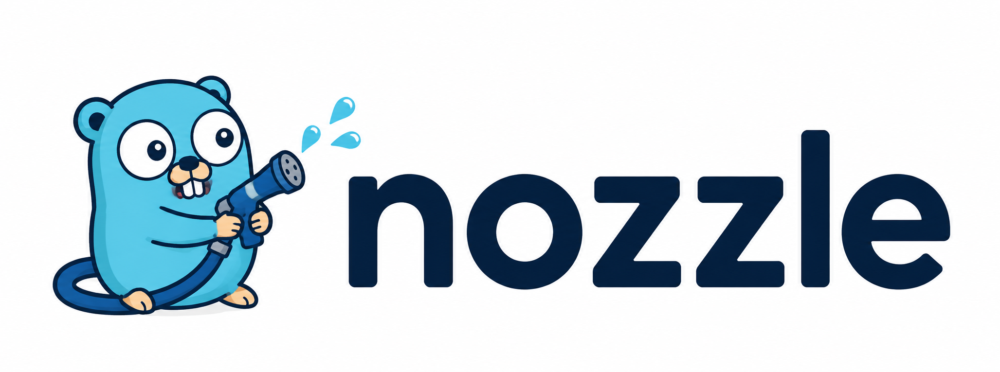

  

# nozzle

A small Go library for purging CDN caches with interchangeable providers.

> Under development. Cloudflare URL planning and sequential purge execution are available; no releases yet.

## Installation and usage

Coming with the first release.

See [Cloudflare](docs/cloudflare.md) for the current API and result semantics.

## Contributing

Want support for your CDN? [Open an issue](https://github.com/go-cdnkit/nozzle/issues)
with a link to its API documentation. Please keep credentials private.

See [Contributing](CONTRIBUTING.md) for local development commands.
